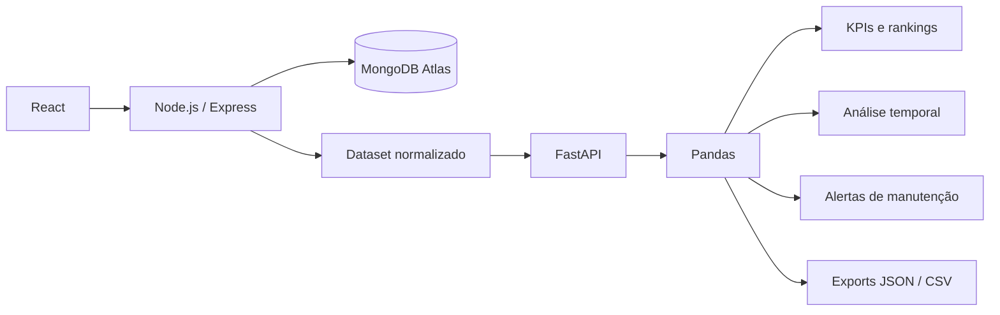
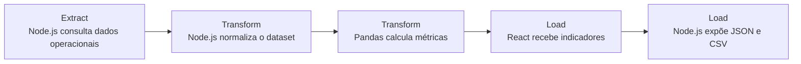
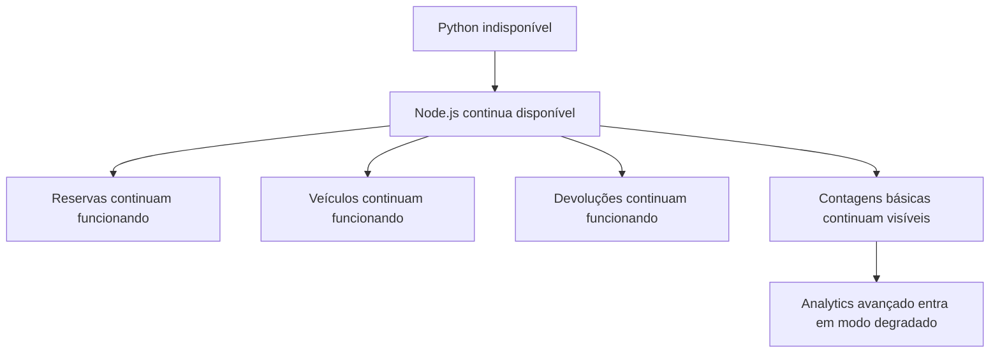

<div align="center">

<br/>

#  Fleet Vehicle Scheduling

### Gestão operacional de frota + inteligência analítica em uma arquitetura full stack

**Node.js · React · MongoDB · Python · FastAPI · Pandas · Docker**

<br/>

[](https://nodejs.org)
[](https://react.dev)
[](https://mongodb.com)
[](https://python.org)
[](https://fastapi.tiangolo.com)
[](https://pandas.pydata.org)
[](https://docker.com)

<br/>

[](https://jestjs.io)
[](https://pytest.org)
[](#-qualidade-e-testes)
[](https://github.com/features/actions)

<br/>

[**🖥️ Live Demo**](https://fleet-vehicle-scheduling.vercel.app)
&nbsp;&nbsp;•&nbsp;&nbsp;
[**⚙️ API**](https://fleet-vehicle-scheduling.onrender.com)
&nbsp;&nbsp;•&nbsp;&nbsp;
[**🩺 Health Check**](https://fleet-vehicle-scheduling.onrender.com/api/health)
&nbsp;&nbsp;•&nbsp;&nbsp;
[**📚 Engineering Journal**](./docs)

<br/>

</div>

---

## ✨ Visão geral

O **Fleet Vehicle Scheduling** nasceu como um sistema de agendamento e gestão de veículos corporativos e evoluiu, fase por fase, até se tornar uma plataforma com **operações de frota, observabilidade, containerização e inteligência analítica**.

Hoje o projeto cobre o ciclo operacional completo:

<table>
<tr>
<td width="50%">

### 🚘 Operação da frota

- gestão de veículos;
- solicitação de reservas;
- aprovação e rejeição;
- cancelamento e conflitos;
- devolução de veículos;
- atualização de quilometragem;
- manutenção por limite de uso.

</td>
<td width="50%">

### 📊 Fleet Intelligence

- KPIs contextuais;
- filtros automáticos;
- análise temporal;
- rankings de utilização;
- demanda por departamento;
- alertas de manutenção;
- insights operacionais;
- exportação JSON e CSV.

</td>
</tr>
</table>

> A aplicação responde duas perguntas diferentes:  
> **o sistema operacional cuida do que precisa acontecer** e a **Fleet Intelligence ajuda a entender o que está acontecendo com a frota**.

---

## 🧠 Destaque da arquitetura

A Phase 13 introduziu uma camada analítica sem transformar Python em um segundo backend público.



### Responsabilidades

| Camada | Papel |
|---|---|
| **React** | Interface operacional, filtros e visualização |
| **Node.js / Express** | API pública, autenticação, autorização, regras operacionais e boundary analítico |
| **MongoDB Atlas** | Fonte de verdade dos dados operacionais |
| **FastAPI** | Contrato interno do serviço analítico |
| **Pandas** | Métricas, rankings, séries temporais, manutenção e exportações |

**Decisões importantes:**

- o frontend **não chama Python diretamente**;
- o serviço Python **não acessa MongoDB diretamente**;
- o backend Node.js continua sendo o **ponto seguro de entrada**;
- a indisponibilidade do analytics **não derruba os fluxos principais**.

---

## 📊 Fleet Intelligence

A área administrativa possui uma experiência dedicada em:

```txt
/admin/analytics
```

O módulo foi pensado como uma camada de **inteligência operacional**, não como uma cópia de uma ferramenta de BI.

### O que a página oferece

<table>
<tr>
<td>

**Contexto e filtros**

- período;
- status;
- veículo;
- departamento;
- atualização automática;
- chips de filtros ativos.

</td>
<td>

**Leitura operacional**

- KPIs contextuais;
- evolução das reservas;
- status com semântica de negócio;
- insights dinâmicos;
- manutenção atual da frota.

</td>
<td>

**Exploração de uso**

- ranking por veículo;
- demanda por departamento;
- quilometragem;
- exportação de dados.

</td>
</tr>
</table>

### Semântica dos status

```txt
EM ANDAMENTO
Pending → Active → Return pending

ENCERRADAS
Completed · Rejected · Cancelled
```

O status técnico `approved` é apresentado como **Active**, deixando mais claro que aprovação é uma etapa operacional e não o fim do ciclo.

---

## 🔄 Mini ETL

A Phase 13 também introduziu um fluxo analítico simples, mas arquiteturalmente separado:



Essa abordagem mantém o projeto proporcional ao problema real, sem introduzir complexidade desnecessária como Airflow, Spark ou data lakes.

---

## 🛡️ Analytics fallback

O serviço analítico é importante, mas não é crítico para o funcionamento operacional.



Isso evita que uma dependência secundária derrube o sistema principal.

---

## 📦 Exportações analíticas

Endpoints disponíveis:

```txt
GET /api/analytics/export/json
GET /api/analytics/export/csv?table=<table>
```

Datasets suportados:

```txt
summary
rentals
vehicles
mileageHistory
rentalsByStatus
vehicleUsage
departmentUsage
rentalTrend
maintenanceAlerts
```

CSV preparado para Excel em ambiente pt-BR:

```txt
Separador: ;
Decimal: ,
Encoding: UTF-8 com BOM
Quebra de linha: CRLF
```

Essa camada deixa o projeto preparado para uma evolução futura com **Power BI**, sem acoplar a aplicação a ele.

---

## 🧪 Qualidade e testes

<table>
<tr>
<td align="center" width="33%">

### Node.js

**37 testes**

5 suites

</td>
<td align="center" width="33%">

### Analytics Node

**19 testes**

3 suites

</td>
<td align="center" width="33%">

### Python

**24 testes**

**96.09% coverage**

</td>
</tr>
</table>

### Cobertura específica do analytics Node.js

```txt
Statements: 82.22%
Branches:   60.31%
Functions:  89.09%
Lines:      87.25%
```

Comandos:

```bash
cd backend
npm test
npm run test:analytics
npm run test:analytics:coverage
```

Python:

```bash
docker compose run --rm analytics-service pytest
```

---

## 🐳 Quick Start com Docker

```bash
git clone <repository-url>
cd Fleet-Vehicle-Scheduling
docker compose up --build
```

| Serviço | URL |
|---|---|
| Frontend | `http://localhost:3000` |
| Backend API | `http://localhost:5000` |
| Backend Health | `http://localhost:5000/api/health` |
| Analytics Service | `http://localhost:8000` |
| Analytics Readiness | `http://localhost:8000/health/ready` |

Parar o ambiente:

```bash
docker compose down
```

---

## 🧰 Stack

<details>
<summary><strong>Ver stack completa</strong></summary>

<br/>

| Categoria | Tecnologia |
|---|---|
| Frontend | React, React Router |
| Backend operacional | Node.js, Express |
| Banco de dados | MongoDB Atlas, Mongoose |
| Autenticação | JWT |
| Analytics | Python, FastAPI, Pandas |
| Validação | Zod, Pydantic |
| Testes Node.js | Jest, Supertest, MongoMemoryServer |
| Testes Python | Pytest, pytest-cov |
| CI/CD | GitHub Actions |
| Containerização | Docker, Docker Compose |
| Hosting | Render, Vercel |
| Cliente HTTP | Axios |
| Tooling | ESLint, Prettier, Nodemon |

</details>

---

## 📂 Estrutura principal

```txt
Fleet-Vehicle-Scheduling/
├── analytics-service/
│   ├── app/
│   ├── tests/
│   ├── Dockerfile
│   └── requirements.txt
├── backend/
│   ├── scripts/
│   ├── src/
│   └── tests/
├── frontend/
│   └── src/
├── docs/
│   ├── phase-1.md
│   ├── ...
│   ├── phase-12.md
│   └── phase-13.md
├── docker-compose.yml
└── README.md
```

---

## 🗃️ Dataset anual demonstrativo

O projeto possui uma seed determinística para simular o fechamento anual de 2025.

```bash
cd backend
npm run seed:annual:dry-run
```

<table>
<tr>
<td><strong>Empresa simulada</strong></td>
<td>1.000 funcionários</td>
</tr>
<tr>
<td><strong>Usuários no sistema</strong></td>
<td>226</td>
</tr>
<tr>
<td><strong>Veículos</strong></td>
<td>5</td>
</tr>
<tr>
<td><strong>Solicitações</strong></td>
<td>1.620</td>
</tr>
<tr>
<td><strong>Reservas concluídas</strong></td>
<td>1.330</td>
</tr>
<tr>
<td><strong>Quilometragem registrada</strong></td>
<td>111.120 km</td>
</tr>
</table>

> Os dados são demonstrativos e simulados. Não representam dados operacionais de uma empresa real.

---

## 🛣️ Evolução do projeto

O projeto foi desenvolvido em fases independentes, cada uma com documentação técnica própria.

| Fase | Foco |
|---|---|
| **01** | Backend foundation |
| **02** | Service layer and business logic |
| **03** | HTTP API, authentication and validation |
| **04** | React frontend foundation |
| **05** | Vehicle rental request workflow |
| **06** | Reservation lifecycle rules |
| **07** | UX and administrative workflows |
| **08** | Production deployment |
| **09** | Fleet lifecycle and vehicle operations |
| **10** | Engineering hardening and backend quality |
| **11** | Observability and operational maturity |
| **12** | Docker containerization and local infrastructure |
| **13** | Fleet Intelligence and operational analytics |

📚 Consulte o histórico completo em [`/docs`](./docs).

---

## 🔍 Phase 13 em uma frase

> O sistema MERN continua responsável pelos fluxos operacionais, enquanto uma camada analítica em FastAPI e Pandas processa um dataset normalizado para gerar KPIs, rankings, análise temporal, manutenção e exportações sem acoplar Python diretamente ao banco ou ao frontend.

---

<div align="center">

### Projeto desenvolvido por Eduardo Henrique

[GitHub](https://github.com/Eduhn26)

<br/>

**13 fases de engenharia · Full stack · Analytics · Docker · Testes · Observabilidade**

<br/>

</div>
